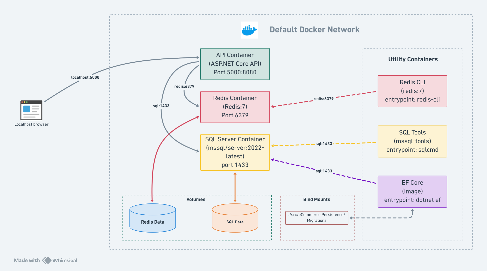

# E-Commerce API

This is a learning project where I practiced building a real-ish E-Commerce backend with ASP.NET Core. It is not meant to be a production-ready store, but I tried to structure it like a serious API so I can learn the patterns properly.

The project includes users, admins, products, categories, reviews, carts, orders, payment methods, payments, authentication, caching, rate limiting, Swagger, Docker, API versioning, logging, and a clean architecture style.

## What I Practiced

- Building a REST API with ASP.NET Core
- Splitting the project into clear layers
- Using Entity Framework Core with SQL Server
- Working with repositories and a basic Unit of Work pattern
- Using DTOs and AutoMapper instead of exposing entities directly
- Adding JWT authentication, Google OAuth, and role-based authorization
- Using Redis as a distributed cache
- Adding rate limiting for sensitive endpoints like login and registration
- Documenting and testing endpoints with Swagger
- Adding API versioning with a custom version header
- Running the app with Docker Compose
- Handling errors with exception middleware and result objects
- Logging requests and application events with Serilog, enrichers, and action filters

## Main Features

### Authentication and Accounts

The API supports normal registration/login, JWT tokens, refresh tokens, Google login using the Google OAuth provider, and role-based access.

There are three main roles:

- `USER`
- `ADMIN`
- `SUPER_ADMIN`

Some endpoints are open, like login and register, but most endpoints require a bearer token.

### DTOs and AutoMapper

The API uses DTOs for request and response models instead of returning database entities directly. AutoMapper is used in the application layer to map between entities and DTOs, which keeps the controllers and services cleaner.

### Products and Categories

Products can be created, updated, deleted, searched, filtered by category, and paginated. Categories are also managed through their own endpoints.

### Cart With Redis Cache

The cart service uses Redis through `IDistributedCache`. When a user's cart is requested, the API first tries to read it from cache. If it is not there, it loads the cart from SQL Server and stores it in Redis.

This was added to practice caching because cart data is read and changed often in E-Commerce apps.

### Orders, Checkout, and Payments

The project has basic order creation, checkout flow, payment records, and saved card payment methods. It is a learning implementation, so it does not connect to a real payment provider.

### Reviews

Users can add reviews for products, and the API includes endpoints to read, update, and delete reviews.

### Rate Limiting

Rate limiting is configured in the API layer. Login, registration, Google login, and refresh token endpoints use a fixed window limiter:

- 5 requests
- per 1 minute
- per IP address

There are also sliding window and concurrency limiter policies configured for practice.

### API Versioning

API versioning is configured with `Asp.Versioning`. The default version is `1.0`, and the API reads the version from the `x-api-version` request header.

### Swagger

Swagger is enabled in development mode. It includes bearer token support, so after logging in you can paste the JWT token and test protected endpoints from the browser.

Default Swagger URL when running locally:

```text
http://localhost:5000/swagger
```

### Exception Handling and Results

The API has a custom exception middleware that catches application exceptions and returns JSON responses with the right HTTP status code.

Inside the services, I used a `Result<T>` pattern for expected success/failure cases like validation errors, not found results, conflicts, and bad requests. This keeps most service methods from throwing exceptions for normal business outcomes.

### Logging and Filters

Serilog is used for structured logging. The configuration also supports enrichers, so log records can include useful context from the app and environment.

There is also a custom `StructuredActionLoggingFilter` that logs controller/action execution with route values, request path, method, trace id, and status code. I added this to practice filters and to make API behavior easier to follow while debugging.

## Controllers and Endpoints

All controllers use this base route:

```text
/api/[controller]
```

The API version is `1.0`, and it can be sent using the `x-api-version` header. Most endpoints require a JWT bearer token because authorization is added globally, except the account endpoints marked as anonymous.

### Account

| Method | Endpoint | Notes |
| --- | --- | --- |
| `POST` | `/api/Account/register` | Register a normal user |
| `POST` | `/api/Account/register-admin` | Register an admin, super admin only |
| `POST` | `/api/Account/register-superadmin` | Register a super admin, super admin only |
| `POST` | `/api/Account/login` | Login with username/password |
| `GET` | `/api/Account/login` | Start Google OAuth login |
| `GET` | `/api/Account/google-response` | Google OAuth callback |
| `PUT` | `/api/Account/update-account/{userId}` | Update account data |
| `POST` | `/api/Account/change-password/{userId}` | Change account password |
| `POST` | `/api/Account/refresh-token/{userId}` | Refresh JWT token |
| `GET` | `/api/Account/logout` | Logout |
| `PUT` | `/api/Account/activate/admin/{adminId}` | Activate admin account, super admin only |

### Products

| Method | Endpoint | Notes |
| --- | --- | --- |
| `GET` | `/api/Products/{pageNumber}/{pageSize}` | Get paginated products, supports search/category/price query filters |
| `GET` | `/api/Products/{productId}` | Get product by id |
| `GET` | `/api/Products/category/{categoryId}` | Get products by category |
| `POST` | `/api/Products` | Add product |
| `PUT` | `/api/Products/{productId}` | Update product, admin/super admin only |
| `DELETE` | `/api/Products/{productId}` | Delete product, admin/super admin only |

### Categories

| Method | Endpoint | Notes |
| --- | --- | --- |
| `GET` | `/api/Categories` | Get all categories |
| `POST` | `/api/Categories` | Add category |
| `PUT` | `/api/Categories/{categoryId}` | Update category, admin/super admin only |
| `DELETE` | `/api/Categories/{categoryId}` | Delete category, admin/super admin only |

### Carts

| Method | Endpoint | Notes |
| --- | --- | --- |
| `GET` | `/api/Carts/user/{userId}` | Get user's cart |
| `POST` | `/api/Carts/user/{userId}/items` | Add item to cart |
| `PUT` | `/api/Carts/user/{userId}/items/{cartItemId}` | Update cart item quantity |
| `DELETE` | `/api/Carts/user/{userId}/items/{cartItemId}` | Remove one cart item |
| `DELETE` | `/api/Carts/user/{userId}/items` | Empty cart |

### Orders

| Method | Endpoint | Notes |
| --- | --- | --- |
| `GET` | `/api/Orders/user/{userId}` | Get user's orders |
| `GET` | `/api/Orders/{orderId}/user/{userId}` | Get order by id |
| `POST` | `/api/Orders/user/{userId}` | Create order |
| `PUT` | `/api/Orders/{orderId}/state` | Update order state, admin/super admin only |
| `DELETE` | `/api/Orders/{orderId}` | Delete order, admin/super admin only |

### Checkout

| Method | Endpoint | Notes |
| --- | --- | --- |
| `POST` | `/api/Checkout/user/{userId}` | Creates an order from the user's cart and clears the cart |

### Reviews

| Method | Endpoint | Notes |
| --- | --- | --- |
| `POST` | `/api/Reviews/{userId}` | Add product review, user only |
| `PUT` | `/api/Reviews/{userId}/{reviewId}` | Update own review, user only |
| `GET` | `/api/Reviews/{reviewId}` | Get review by id |
| `GET` | `/api/Reviews/product/{productId}` | Get reviews for a product |
| `DELETE` | `/api/Reviews/{userId}/{reviewId}` | Delete own review, user only |

### Payment Methods

| Method | Endpoint | Notes |
| --- | --- | --- |
| `GET` | `/api/PaymentMethods/user/{userId}` | Get user's saved card payment methods |
| `GET` | `/api/PaymentMethods/{paymentMethodId}/user/{userId}` | Get payment method by id |
| `POST` | `/api/PaymentMethods/user/{userId}` | Add card payment method |
| `PUT` | `/api/PaymentMethods/{paymentMethodId}/user/{userId}` | Update card payment method |
| `DELETE` | `/api/PaymentMethods/{paymentMethodId}/user/{userId}` | Delete card payment method |

### Payments

| Method | Endpoint | Notes |
| --- | --- | --- |
| `GET` | `/api/Payments/user/{userId}` | Get user's payment records |
| `GET` | `/api/Payments/{paymentId}/user/{userId}` | Get payment by id |
| `GET` | `/api/Payments/order/{orderId}/user/{userId}` | Get payment by order id |

## Project Structure

The solution is split into five main projects:

```text
src/
  eCommerce.Api/             API controllers, middleware, filters, Swagger, auth setup
  eCommerce.Application/     Services, DTOs, mapping, app-level business logic
  eCommerce.Domain/          Entities, enums, interfaces, identity models
  eCommerce.Persistence/     DbContext, EF Core configs, repositories, migrations
  eCommerce.Infrastructure/  External/service implementations like JWT service
```

I used this structure to keep responsibilities separated:

- `Api` receives HTTP requests and returns responses.
- `Application` contains the use cases, services, DTOs, AutoMapper profiles, and result objects.
- `Domain` contains the core models and contracts.
- `Persistence` handles SQL Server, EF Core, repositories, migrations, and the Unit of Work.
- `Infrastructure` contains technical services that support the application.

## Dockerization

The project can run with Docker Compose. It starts the API, SQL Server, Redis, and some optional utility containers.



Docker Compose services:

- `api` - the ASP.NET Core Web API
- `sql` - SQL Server 2022 database
- `redis` - Redis cache used by the cart service
- `ef-core` - utility container for running EF Core commands
- `redis-cli` - utility container for Redis commands
- `sql-tools` - utility container for SQL Server commands

The API talks to SQL Server for persistent data and Redis for cached cart and products data.

## Running With Docker

Create your environment file from the example:

```powershell
copy .env.example .env
```

Then update the passwords and secrets inside `.env`. The project also uses `api.env` for API configuration values.

Start the containers:

```powershell
docker compose up --build
```

Then open:

```text
http://localhost:5000/swagger
```

The port depends on `API_PORT` in `.env`.

## Useful Docker Commands

Run the app:

```powershell
docker compose up --build
```

Stop containers:

```powershell
docker compose down
```

Run EF Core commands through the EF utility container:

```powershell
docker compose --profile tools run --rm ef-core database update --project src/eCommerce.Persistence --startup-project src/eCommerce.Api
```

Open Redis CLI:

```powershell
docker compose --profile tools run --rm redis-cli -h redis -a <redis-password>
```

## Local Development Notes

The API targets `.NET 10`.

To build the API locally:

```powershell
dotnet build src/eCommerce.Api/eCommerce.Api.csproj
```

To run it locally without Docker, make sure SQL Server and Redis are available and the connection strings are configured.

## Important Notes

This project is for learning only. Some parts are simplified on purpose, especially payments. The main goal was to practice backend architecture, API design, authentication, caching, Docker, and working with real infrastructure pieces together.
